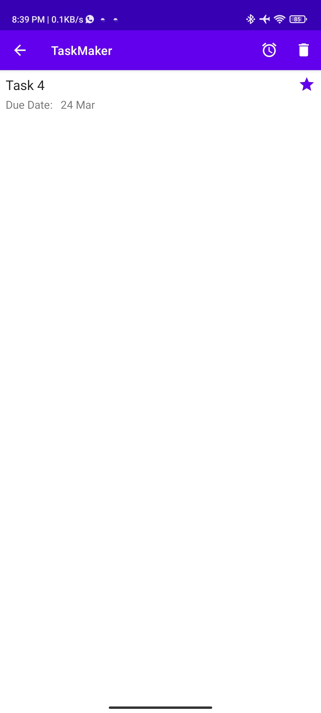

# TaskMaker
This is an android project developed in order to practice and prepare for the Google Associate Android Developer Exam (AAD). 
I tried to implement most of the topics in the [Study guide](https://developers.google.com/certification/associate-android-developer/study-guide) and
I used the Exam past question in this [article](https://medium.com/@suyoggunjal/google-certified-android-developer-59af40bae846) as the basis for this project. 

## Topics 
- UI — (Constraint Layout etc.)
- Widgets like Checkbox, Time Picker and Date Picker
- RecyclerView, Pagination Library
- Menu 
- LiveData and ViewModel
- Activity, Fragment Transactions
- MVVM Architecture (Repository Pattern)
- Room Database, Sorting Query
- Notifications (In-App)
- Alarm Manager and Work Manager
- Shared Preferences and Settings Preferences 
- App Settings for light and dark theme
- Debugging
- Unit Test Cases and UI Test Cases (Espresso)

## Prerequisite
To build this project, you require:
- Android Studio Bumblebee | 2021.1.1 Patch 2
- Gradle 7.1.2
- Kotlin 1.6.10

## App ScreenShots
<h4 align="center">

                                                                           
## Addition Resources
- [Android Basics in Kotlin](https://developer.android.com/courses/android-basics-kotlin/course) (I will encourage you to try and complete the projects in each unit of this resource) 
- Articles on the AAD Examination
    - https://medium.com/geekculture/associate-android-developer-certification-kotlin-exam-2b9b08985ad9
    - https://s-threepio.medium.com/associate-android-developer-certification-by-google-114ab755c187
    - https://puneet-grover.medium.com/preparation-strategy-to-crack-google-associate-android-developer-with-kotlin-certification-b86be531984a
                                                                           
## Author
Babatunde Owoleke

## License
This project is licensed under the Apache License 2.0 - See: http://www.apache.org/licenses/LICENSE-2.0.txt
                                                                      
